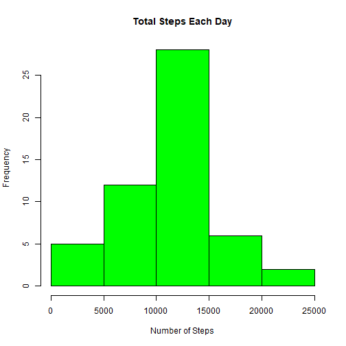
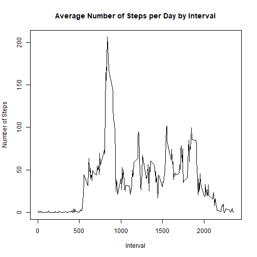
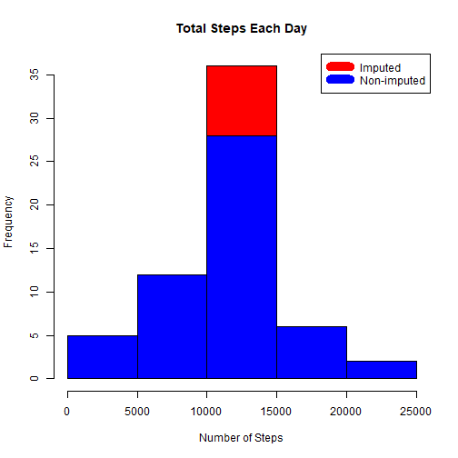
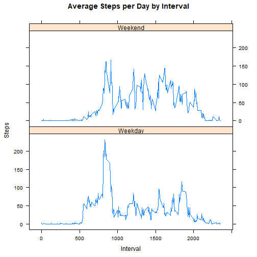

## Reproducible Research Peer Assessment 1

This is file for solution of Project 1 on the course that mentioned above

# Load data


```r
if (!file.exists('activity.csv')) {
  unzip('./repdata_data_activity.zip', exdir = '.');
}

data <- read.csv('activity.csv');
```

# Histogram of total number of steps taken per day


```r
steps_by_day <- aggregate(steps ~ date, data, sum)
hist(steps_by_day$steps, main = paste("Total Steps Each Day"), col="green",xlab="Number of Steps")
```



# Mean and median number of steps taken each day

```r
rmean <- mean(steps_by_day$steps)
rmean
```

```
## [1] 10766.19
```

```r
rmedian <- median(steps_by_day$steps)
rmedian
```

```
## [1] 10765
```

# Time series plot of the average number of steps taken

```r
steps_by_interval <- aggregate(steps ~ interval, data, mean)
plot(steps_by_interval$interval,steps_by_interval$steps, type="l", xlab="Interval", ylab="Number of Steps",main="Average Number of Steps per Day by Interval")
```



# The 5-minute interval that, on average, contains the maximum number of steps


```r
max_interval <- steps_by_interval[which.max(steps_by_interval$steps),1]
max_interval
```

```
## [1] 835
```

# Code to describe and show a strategy for imputing missing data


```r
NATotal <- sum(!complete.cases(data))
NATotal
```

```
## [1] 2304
```

```r
StepsAverage <- aggregate(steps ~ interval, data = data, FUN = mean)
fillNA <- numeric()
for (i in 1:nrow(data)) {
  obs <- data[i, ]
  if (is.na(obs$steps)) {
    steps <- subset(StepsAverage, interval == obs$interval)$steps
  } else {
    steps <- obs$steps
  }
  fillNA <- c(fillNA, steps)
}

new_activity <- data
new_activity$steps <- fillNA
```

# Histogram of the total number of steps taken each day after missing values are imputed

```r
StepsTotalUnion <- aggregate(steps ~ date, data = new_activity, sum, na.rm = TRUE)
hist(StepsTotalUnion$steps, main = paste("Total Steps Each Day"), col="red", xlab="Number of Steps")
hist(steps_by_day$steps, main = paste("Total Steps Each Day"), col="blue", xlab="Number of Steps", add=T)
legend("topright", c("Imputed", "Non-imputed"), col=c("red", "blue"), lwd=10)
```



#average number of steps taken per 5-minute interval across weekdays and weekends

```r
rmeantotal <- mean(StepsTotalUnion$steps)
rmeantotal
```

```
## [1] 10766.19
```

```r
rmediantotal <- median(StepsTotalUnion$steps)
rmediantotal
```

```
## [1] 10766.19
```

```r
rmediandiff <- rmediantotal - rmedian
rmediandiff
```

```
## [1] 1.188679
```

```r
rmeandiff <- rmeantotal - rmean
rmeandiff
```

```
## [1] 0
```

#plot comparing the average number of steps taken per 5-minute interval across weekdays and weekends

```r
weekdays <- c("Monday", "Tuesday", "Wednesday", "Thursday", 
             "Friday")
new_activity$dow = as.factor(ifelse(is.element(weekdays(as.Date(new_activity$date)),weekdays), "Weekday", "Weekend"))
StepsTotalUnion <- aggregate(steps ~ interval + dow, new_activity, mean)
library(lattice)
xyplot(StepsTotalUnion$steps ~ StepsTotalUnion$interval|StepsTotalUnion$dow, main="Average Steps per Day by Interval",xlab="Interval", ylab="Steps",layout=c(1,2), type="l")
```



```r
knitr::opts_chunk$set(fig.path='Figs/')
```
